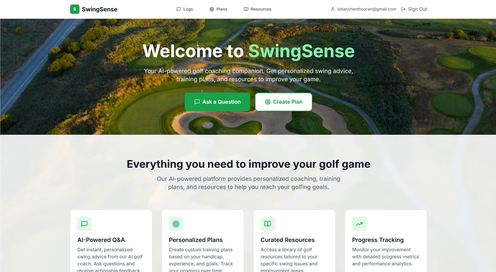

# SwingSense 🏌️‍♂️🏌️‍♀️  
---
## Visuals
 

---
## Inspiration  
Golf has been a part of my life since I was five years old, and over the years, I’ve progressed from a beginner to becoming a competitive player. Along the way, I’ve faced challenges at every stage of the game, from struggling to hit consistent shots to refining advanced techniques.  

Since starting university, it hasn’t been as easy to get rounds in and stay on the course as much as I’d like. I wanted a way to stay connected to the game while continuing to improve. Without professional lessons, self-learning can be frustrating—finding actionable feedback isn’t always easy.  

This inspired me to create **SwingSense**:an AI-powered coaching platform built not just for myself, but for golfers of all skill levels, to provide personalized feedback, training plans, and resources that make improvement more accessible and effective.  

---

## What It Does  
**SwingSense** is an AI-powered golf coaching application that combines data-driven insights with personalized feedback. The platform allows golfers to:  
- Ask swing-related questions and receive instant, tailored advice from an AI golf coach.  
- Generate custom 4-week training plans based on handicap, experience, and goals.  
- Access AI-curated resources including drills, videos, and articles targeted to swing issues.  
- Track progress and review improvement over time through a secure user dashboard.  

---

## Core Features  
- **AI-Powered Q&A** – Personalized advice powered by GPT-4.  
- **Training Plan Generation** – Custom 4-week plans tailored to skill level and goals.  
- **Curated Resources** – Drills, videos, and articles matched to swing challenges.  
- **Progress Tracking** – Review Q&A history and training logs over time.  
- **User Authentication** – Secure login/signup with Supabase.  

---

## Tech Stack  

### Frontend  
- **Next.js 14 (App Router)**  
- **React 18** with **TypeScript**  
- **Tailwind CSS**  
- **Supabase** for authentication  
- **Axios** for API calls  
- **Lucide React** for icons  

### Backend  
- **FastAPI (Python)**  
- **PostgreSQL** with **SQLAlchemy ORM**  
- **Alembic** for migrations  
- **OpenAI GPT-4** integration  
- **Supabase JWT authentication**  
- **Pydantic** for validation  

---

## Deployment  
- **Frontend**: Vercel (Next.js optimized)  
- **Backend**: Render or similar cloud platform  
- **Database**: Cloud-hosted PostgreSQL (e.g., Supabase, NeonDB, RDS)  

---

## Future Enhancements  
- **Computer Vision Swing Analysis** – Use OpenCV + MediaPipe to analyze swings and compare against professional benchmarks.  
- **Social Features** – Enable golfers to connect, share progress, and learn from each other.  

---
